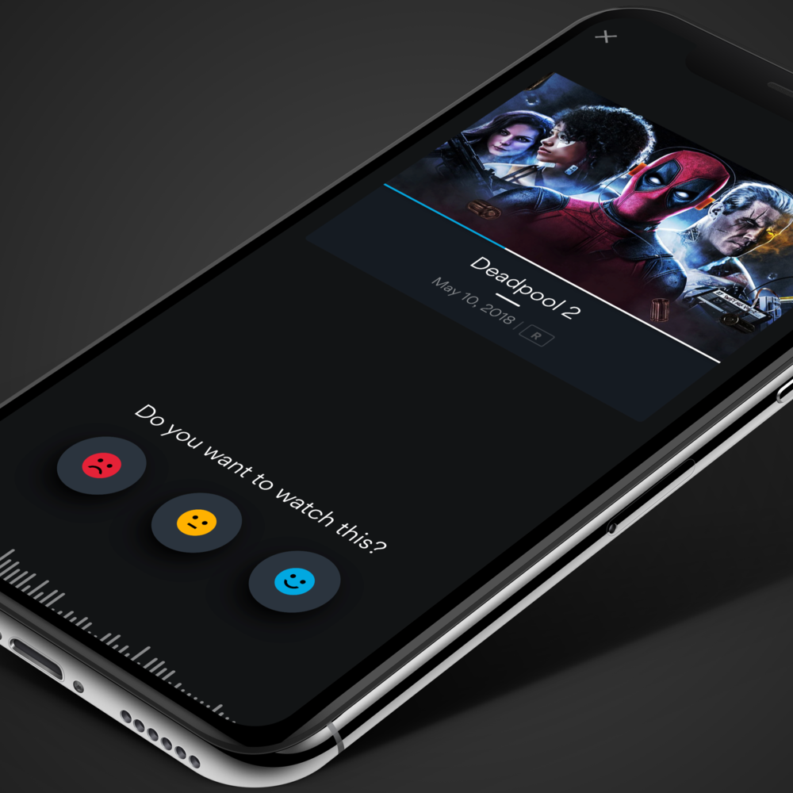
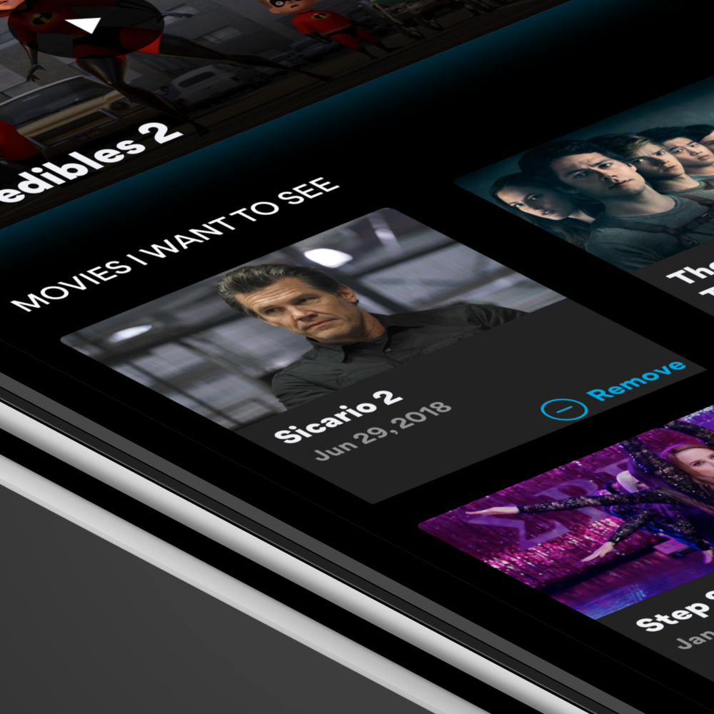

[TrailerVote][0] is the exhibition industry's hottest growth tool. It provides
in-theatre trailer analytics and mobile app re-marketing.

## Challenge

Most cinemas, offering no or spotty WiFi, are struggling with sign-ups into
their loyalty programs; lack insights in which advertisements (trailers) lead to
sales and can't perfectly predict how many time slots should be allocated for
a movie during opening weekend.

When TrailerVote's founder contacted XP Bytes, they had just started looking for
a lasting partnership building upon the work of an initial Tech Demo. The basis
was there, but now the system had to be able to withstand an exponential
roll-out across cinemas, all over the world. The current implementation would
not be able to even sustain 10 users a minute.

## Solution

XP Bytes set up a series of micro-services, each with their own tasks:

- Ingest Trailers from other systems, such as those from their partners,
- Ingest metadata for these trailers, such as backdrops, descriptions,
- Create unique identifiers for each segment of a trailer,
- Listen and track votes, anonymously,
- Propgate static content across edges around the world,
- Provide views for in-app and SDK consumption,
- An administrative CMS,
- An analytics dashboard.

The [Ruby on Rails][1] web application framework was used to quickly bootstrap
the applications; API format of responses were defined in [media types][2] and
these were registered; [Node JS][4] (with TypeScript) was the primary candidate
to generate views that the mobile SDKs could easily consume.

Because we had to deal with a potentially gigantic amount of data when a movie
screens across countries, and people vote, simultainously; because we wanted to
be able to aggregate, display and transform votes over time; to comply with
the various privacy laws, including GDPR, we chose a [time series database][3].

## Results

Because of the systems we've built, trailers could now be scoped per cinema
location; data could be shown in many languages; API design allows the SDKs to
be updated only sporadically; the system being capable of handling over a
million requests a minute.

There was no longer a tech demo, but a complete eco-system and this has allowed
[Trailervote][0] to showcase around the globe, with pilots starting everywhere.

[0]: https://trailervote.com/
[1]: https://rubyonrails.org/
[2]: https://github.com/TrailerVote/trailervote-media-types/tree/master/ruby
[3]: https://www.influxdata.com/
[4]: https://nodejs.org
